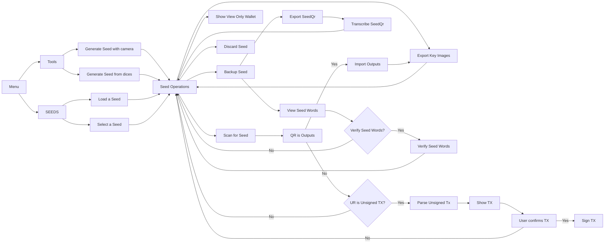

# XmrSigner Documentation

## How XmrSigner actualy works

```mermaid
graph LR
    MENU[Menu] --> TOOLS[Tools];
    TOOLS --> CAM_SEED;
    TOOLS --> DICES_SEED; 
    MENU --> SEEDS;
    SEEDS --> LOAD_SEED;
    SEEDS --> SELECT_SEED;
    CAM_SEED[Generate Seed with camera] --> SEED_OPS;
    DICES_SEED[Generate Seed from dices] --> SEED_OPS;
    LOAD_SEED[Load a Seed] --> SEED_OPS;
    SELECT_SEED[Select a Seed] --> SEED_OPS
    SEED_OPS[Seed Operations] --> BACKUP_SEED;
    SEED_OPS --> EXPORT_KEY_IMAGES[Export Key Images];
    SEED_OPS --> VIEW_ONLY[Show View Only Wallet];
    SEED_OPS --> SCAN_FOR_SEED[Scan for Seed];
    SEED_OPS --> DISCARD[Discard Seed];
    BACKUP_SEED[Backup Seed] --> SEED_WORDS;
    SEED_WORDS[View Seed Words] --> F{Verify Seed Words?};
    F -->|Yes| VERIFY_SEED[Verify Seed Words];
    F -->|No| SEED_OPS;
    VERIFY_SEED --> SEED_OPS;
    BACKUP_SEED --> SEED_QR[Export SeedQr];
    SEED_QR --> TRANSCRIBE_SEED[Transcribe SeedQr];
    TRANSCRIBE_SEED --> SEED_OPS;
    SCAN_FOR_SEED --> IS_OUTPUTS[QR is Outputs];
    IS_OUTPUTS -->|Yes| IMPORT_OUTPUTS[Import Outputs];
    IS_OUTPUTS -->|No| IS_UNSIGNED_TX{UR is Unsigned TX?};
    IMPORT_OUTPUTS --> EXPORT_KEY_IMAGES;
    EXPORT_KEY_IMAGES --> SEED_OPS;
    IS_UNSIGNED_TX -->|Yes| PARSE_UNSIGNED_TX[Parse Unsigned Tx];
    IS_UNSIGNED_TX -->|No| SEED_OPS;
    PARSE_UNSIGNED_TX --> SHOW_TX[Show TX];
    SHOW_TX --> USER_CONFIRM_TX[User confirms TX];
    USER_CONFIRM_TX -->|Yes| SIGN_TX[Sign TX];
    USER_CONFIRM_TX -->|No| SEED_OPS;
```
